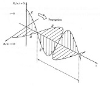

# NIST Industrial Wireless Analysis
This repository contains code for analyzing industrial wireless sounder measurements
and the generation of wireless scenarios.

**DISCLAIMER**: Certain commercial equipment, instruments, or materials are identified in this paper in order to specify the experimental procedure adequately. Such identification is not intended to imply recommendation or endorsement by NIST, nor is it intended to imply that the materials or equipment identified are necessarily the best available for the purpose.

 

## Repository Structure
### Main components
* meas_analysis:    Includes files for analyzing RF Sounder measurements of various factories. 
  Data may be found at http://doi.org/10.18434/T44S3N
* tap_reduction:    Library for generating an N-sampled impulse response for RF channel emulator integration
* www_scripts:      Python scripts used to generate file listings used by the www data landing page

## Meas_Analysis M-Code Library

### Main analysis code (M code)
MATLAB computer code used for the analysis of RF propagation measurement data.  
Analysis includes the following:
* Gain versus Distance
* Line-of-sight versus Non-Line-of-Sight
* Rician K-factor
* First andnSecond Order delay spread
* Figure production for publication
* Statistical approximations
* Tabulation of results

The main M code entry point is *estimate_channel_cwd.m* for processing of NIST channel impulse response MAT files
Use the file *analyze_cwd.m* for an example of calling *estimate_channel_cwd.m*.  
```
>> estimate_channel_cwd('*.mat',[1;1;1;1;0;1]);
```
This will process each of the identified MAT files in the current working directory.  Output of the procssing will 
include the following:
* **channel stats**: MAT files located in the stats folder that includes output of processing
* **fig**:  MATLAB figures produced by the analysis
* **png**:  publication quality figures

### N_Tap Reduction
The file *stats2rfnestdp.m* is used to reduce average impulse responses to usable size within our testbed.
The following command will convert the average channel impulse responses stored in the stat.mat files into
13-tap delay profile configuration files used by the RFNest D508/512. 
```
stats2rfnestdp( '*_stats.mat', '.', '..\..\emu' )
```
RFNest is the current emulation platform in use by NIST Industrial Wireless project.  It provides the capability
of reproducing a 4 ns resolution tap-delay response for each link in an N\*(N-1) mesh network at a 250 MHz sample rate.


### +reporting module (M code)
Code used for the generation of the NIST Technical Report XYZW latex-based report. Reporting code includes the following:
* Figure production for publication
* Statistical approximations
* Tabulation of results into Latex tables
* Automation of full latex-based reporting

To initiate generation of the report, MAT files must first be processed using *estimate_channel_cwd.m*.  Afterward, change 
directory to the stats folder and run the following commands.
```
reporting.makeStatsSummary('stats.dat','*_stats.mat');  % builds the summary channel statisticas
reporting.summarizeStatsFile();                         % tabulates statistics into latex tables
reporting.makeLatexFigReport();                         % produces a latex sub-report tex file for detailed analysis of measurements
```


